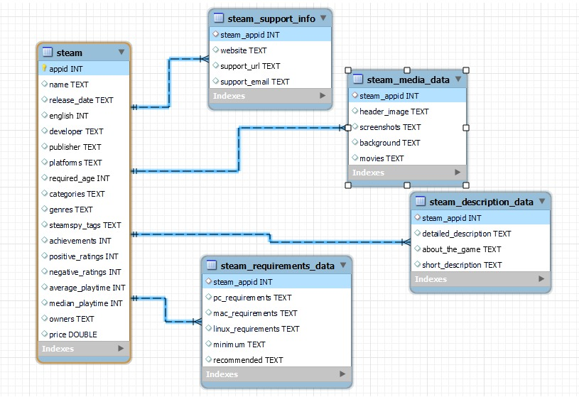
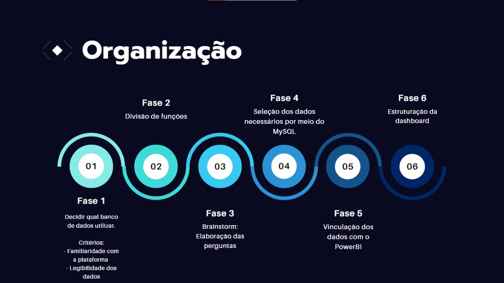
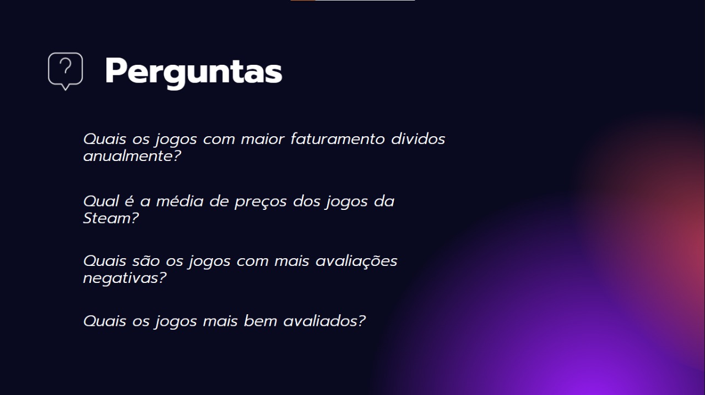
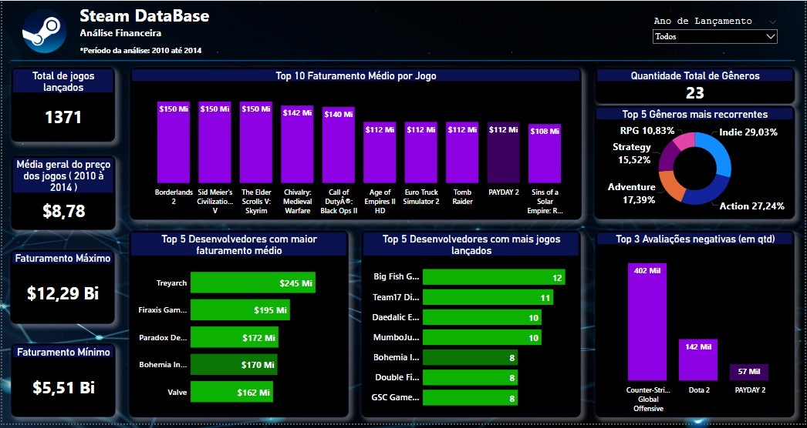
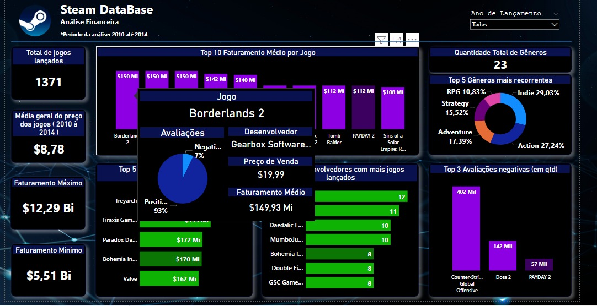

<h1 align='center'>  Dashboard Steam Data </h1>
   
<ul >🔹 O que é a Steam? </ul>
  
A Steam é uma fornecedora de jogos virtuais e uma fonte de informações e lançamentos sobre esse universo. Além disso, é possível adquirir games por valores mais acessíveis, fazer uma instalação mais prática e gerenciar jogos de diferentes máquinas ou notebooks gamers com segurança e suporte da empresa. 

  
<ul >🔹 Nossa proposta </ul>
  
Utilizando a base de dados disponibilizada, criar uma dashboard que responda as perguntas formuladas pelo grupo.  

  
<h2 align='center'> Nosso Grupo </h2>
 

  

    <h3> Julia Soares </h3>
     
    <h3> Taila Lima</h3>
     
  

  <h3> Vanessa Silva</h3>
    
   
   
  
  <h2>Ferramentas Utilizadas:</h2>
  <li> Scrum</li>
  <li> Mysql</li>
  <li> Power BI</li>
  <li> Kanban</li>
  
  

  <h2>O banco de dados recebido </h2>
     
    
     
  
Os dados foram relacionados por meio do 'appid'

  

  

     
    
    
     
  

  
  

     <h1>  A dashboard </h1>
        
        
        
       
        
        
       
        
        
  

  
 Link para a apresentação https://www.canva.com/design/DAEwl5JF9tg/YeOdise9ycr8au6KYmcZIw/edit 

